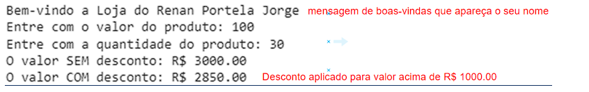

QUESTÃO 1 de 4 - Conteúdo até aula 03

Enunciado: Imagina-se que você é um dos
programadores responsáveis pela construção de app de vendas para uma
determinada empresa X que vende em atacado. Uma das estratégias de vendas dessa
empresa X é dar desconto maiores conforme o valor da compra conforme a  **listagem
abaixo** :

·
Se valor for **menor** que 1000 o desconto
será de 0%;

·
Se valor for **igual ou maior** que 1000 e **menor
que** 3000 o desconto será de 3%;

·
Se valor for **igual ou maior** que 3000 e **menor
que** 5000 o desconto será de 5%;

·
Se valor for **igual ou maior** que 5000 o
desconto será de 8%;

Elabore um programa em Python que:

A.
Deve-se implementar o print com uma mensagem de
boas-vindas que apareça o seu nome [EXIGÊNCIA DE CÓDIGO 1 de 6];

B.
Deve-se implementar o input do **valor unitário** e da
**quantidade** do produto [EXIGÊNCIA
DE CÓDIGO 2 de 6];

C.
Deve-se implementar o desconto **conforme a enunciado
acima** (obs.: atente-se as condições de menor, igual e maior) [EXIGÊNCIA DE CÓDIGO 3 de 6];

D.
Deve-se implementar o** valor total sem desconto** e
o **valor total com desconto** [EXIGÊNCIA DE CÓDIGO 4 de 6];

E.
Deve-se implementar as estruturas  **if, elif e else (todas
elas) ** [EXIGÊNCIA DE CÓDIGO
5 de 6];

F.
Deve-se inserir comentários **relevantes** no
código [EXIGÊNCIA DE CÓDIGO 6
de 6];

G.
Deve-se apresentar na saída de console uma mensagem de
boas-vindas com seu nome [EXIGÊNCIA
DE SAÍDA DE CONSOLE 1 de 2];

H.
Deve-se apresentar na saída de console um pedido recebendo
desconto (**valor total sem desconto **acima de 1000 ) [EXIGÊNCIA DE SAÍDA DE CONSOLE 2 de 2];

EXEMPLO DE SAÍDA DE CONSOLE:

**Figura 1: Exemplo de saída de console que o aluno deve fazer.
 Em que se perguntar o valor do produto
(pode ser qualquer valor) a quantidade (pode ser qualquer valor)  o resultado da multiplicação produto pela
quantidade deve ser maior que 1000 para que haja desconto.**
