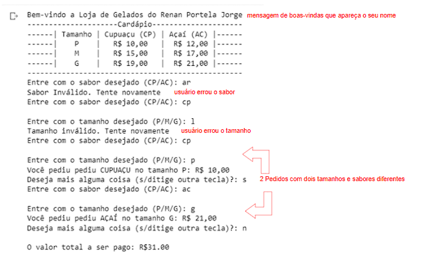

QUESTÃO 2 de 4 - Conteúdo até aula 04

Enunciado: Você e sua equipe de programadores foram
contratados para desenvolver um app de vendas para uma loja que vende Açaí e
Cupuaçu. Você ficou com a parte de desenvolver a interface do cliente para
retirada do produto.

A Loja possui seguinte relação:

·
Tamanho **P** de Cupuaçu ( **CP** ) custa 10
reais e o Açaí ( **AC** ) custa 12 reais;

·
Tamanho **M** de Cupuaçu ( **CP** ) custa 15
reais e o Açaí ( **AC** ) custa 17 reais;

·
Tamanho **G** de Cupuaçu ( **CP** ) custa 29
reais e o Açaí ( **AC** ) custa 21 reais;

Elabore um programa em Python que:

A.
Deve-se implementar o print com uma mensagem de
boas-vindas que apareça o seu nome [EXIGÊNCIA DE CÓDIGO 1 de 8];

B.
Deve-se implementar o input  do  **sabor ** (CP/AC) e o print “Sabor inválido.
Tente novamente" se o usuário entra com valor diferente de CP e AC [EXIGÊNCIA DE CÓDIGO 2 de 8];

C.
Deve-se implementar o input  do  **tamanho ** (P/M/G) e o print “Tamanho inválido.
Tente novamente" se o usuário com entra valor diferente de P,M ou G [EXIGÊNCIA DE CÓDIGO 3 de 8];

D.
Deve-se implementar if/elif com cada uma das
combinações de **sabor **e  **tamanho do enunciado  ** [EXIGÊNCIA DE CÓDIGO 4 de 8];

E.
Deve-se implementar um **acumulador** para somar os
valores dos pedidos [EXIGÊNCIA
DE CÓDIGO 5 de 8];

F.
Deve-se implementar o input com a pergunta: “Deseja
pedir mais alguma coisa?”. Se sim  **repetir a partir do item B** , senão encerrar
o programa executar o print do **acumulador** [EXIGÊNCIA DE CÓDIGO 6 de 8];

G.
Deve-se implementar as estruturas de **while, break,
continue (todas elas)** [EXIGÊNCIA
DE CÓDIGO 7 de 8];

H.
Deve-se inserir comentários **relevantes** no
código [EXIGÊNCIA DE CÓDIGO 8
de 8];

I.
Deve-se apresentar na saída de console uma mensagem de
boas-vindas com o seu nome [EXIGÊNCIA
DE SAÍDA DE CONSOLE 1 de 4];

J.
Deve-se apresentar na saída de console um pedido em que
o usuário errou o **sabor** [EXIGÊNCIA
DE SAÍDA DE CONSOLE 2 de 4];

K.
Deve-se apresentar na saída de console um pedido em que
o usuário errou o **tamanho** [EXIGÊNCIA DE SAÍDA DE CONSOLE 3 de 4];

L.
Deve-se apresentar na saída de console um pedido com
duas opções sabores diferentes e com tamanhos diferentes [EXIGÊNCIA DE SAÍDA DE CONSOLE 4 de 4];

EXEMPLO DE SAÍDA DE CONSOLE:

**Figura 2: Exemplo de saída de console que o aluno deve
fazer.  Em que se perguntar o sabor ao
tamanho. Há uma tentativa de pedido que se erro o sabor e outra que se errou o
tamanho. Há também dois pedidos com sabores e tamanhos.**
