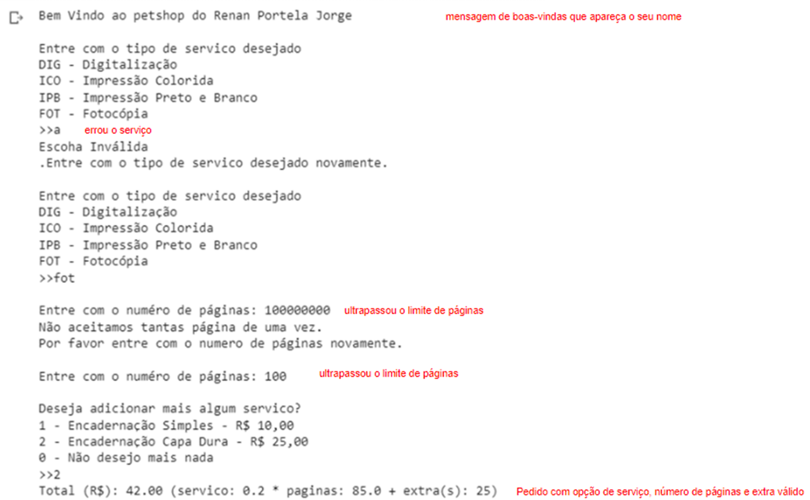

QUESTÃO 3 de 4 - Conteúdo até aula 05

Enunciado: Você foi contratado para desenvolver um
sistema de cobrança de serviços de uma copiadora. Você ficou com a parte de
desenvolver a interface com o funcionário.

A copiadora opera da seguinte maneira:

·
Serviço de Digitalização (DIG) o custo por
página é de um real e dez centavos;

·
Serviço de Impressão Colorida (ICO) o custo por
página é de um real;

·
Serviço de Impressão Preto e Branco (IBO) o
custo por página é de quarenta centavos;

·
Serviço de Fotocópia (FOT) o custo por página é
de vinte centavos;

·
Se número de páginas for **menor** que 10 retornar
o número de página sem desconto;

·
Se número de páginas for **igual ou maior** que
10 e **menor** que 100 retornar o número de páginas  com o desconto é de 10%;

·
Se número de páginas for** igual ou maior**
que 100 e **menor** que 1000 retornar o número de páginas  com o desconto é de 15%;

·
Se número de páginas for** igual ou maior**
que 1000 e **menor** que 10000 retornar o número de páginas  com o desconto é de 20%;

·
Se número de páginas for **maior ou igual** à
10000 não é aceito pedidos nessa quantidade de páginas;

♦
Para o **adicional **de encadernação simples
(1) é cobrado um valor **extra **de 10 reais;

♦
Para o **adicional **de encadernação de capa
dura (2) é cobrado um valor **extra **de 25 reais;

♦
Para o **adicional **de não querer mais nada
(0) é cobrado um valor **extra **de 0 reais;

O valor final da conta é calculado da seguinte
maneira:

total = **servico

* num_pagina + extra**

Elabore um programa em Python que:

A.
Deve-se implementar o print com uma mensagem de
boas-vindas que apareça o seu nome [EXIGÊNCIA DE CÓDIGO 1 de 7];

B.
Deve-se implementar a função **escolha_servico() **em
que **: ** [EXIGÊNCIA DE
CÓDIGO 2 de 7];

a.Pergunta
o **servico **desejado;

b.Retorna
ovalor **servico **com base na escolha do usuário;

c.  Repete
a pergunta do item B.a se digitar **servico **se digitar uma opção diferente
de: dig/ico/ibo/fot;

C.
Deve-se implementar a função **num_pagina() **em que **:
** [EXIGÊNCIA DE CÓDIGO 2 de 6];

a.Pergunta
o  **número de páginas** ;

b.Retorna
o** número de páginas** com desconto seguindo a regra do enunciado;

c.  Repete
a pergunta do item C.a se digitar uma opção diferente de: c/m/l;

D.
Deve-se implementar a função **servico_extra() **em
que **: ** [EXIGÊNCIA DE
CÓDIGO 3 de 6];

a.Pergunta
pelo serviço  **adicional** ;

b.Acumular
o valor **extra **de cada** adicional;**

c.  Repetir
a pergunta item D.a enquanto não se digitar opção de: "não querer mais
nada (0)";

d.Quando
digitar o **adicional **não querer mais nada (0) retornar o valor **extra;**

E.
Deve-se implementar o total a pagar na parte do main conforme
o enunciado [EXIGÊNCIA DE
CÓDIGO 4 de 6];

F.
Deve-se implementar **try/except** [EXIGÊNCIA DE CÓDIGO 5 de 6];

G.
Deve-se inserir comentários relevantes no código [EXIGÊNCIA DE CÓDIGO 6 de 6];

H.
Deve-se apresentar na saída de console uma mensagem de
boas-vindas com o seu nome [EXIGÊNCIA
DE SAÍDA DE CONSOLE 1 de 4];

I.
Deve-se apresentar na saída de console um pedido no
qual o usuário errou a opção de serviço[EXIGÊNCIA DE SAÍDA DE CONSOLE 1 de 4];

J.
Deve-se apresentar na saída de console um pedido no
qual o usuário digitou ultrapassou no número de páginas [EXIGÊNCIA DE SAÍDA DE CONSOLE 2 de 4];

K.
Deve-se apresentar na saída de console um pedido com
opção de serviço, número de páginas e serviço extra válidos[EXIGÊNCIA DE SAÍDA DE CONSOLE 3 de 4];

EXEMPLO DE SAÍDA DE CONSOLE:

**Figura 3: Exemplo de
saída de console que o aluno deve fazer.
Em que se pergunta pelo tipo de serviço e se erra opção inicialmente,
que se passa do número de páginas aceito. Na sequência, o usuário digitou um
valor de serviço, número de páginas e extras válidos.**
